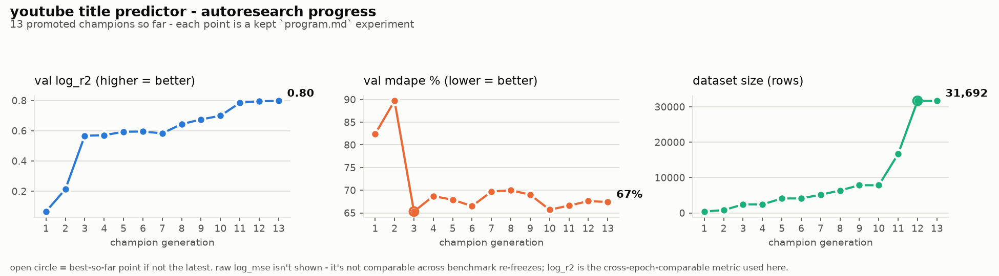

# youtube title → view predictor



predicts how many views a youtube video might get based on its title (plus a few side signals). trained on live data scraped with yt-dlp — no api key needed.

**primary use case: comparing titles, not forecasting one in isolation.** title alone explains a modest share of view variance (val `log_r2` ~0.68, `mdape` ~69% — see "notes" below), so a single absolute prediction is a soft number. what's robust is holding everything *except* the title fixed (same category/duration/followers/thumbnail) and ranking a few candidate titles against each other — systematic error in the shared, imputed-or-real context cancels out of that comparison instead of compounding into it. `predict.py` does this automatically whenever you pass it more than one title (see "usage" below) — that's the intended way to use this tool, not a bonus feature.

this is set up as an **autoresearch**-style project (see [karpathy/autoresearch](https://github.com/karpathy/autoresearch)): a frozen, comparable benchmark; one north-star metric (val `log_mse`); a narrow surface a coding agent iterates on; and a mechanical keep/discard loop. `program.md` is the actual instructions for running that loop — it's the recursive self-improvement (RSI) engine behind the numbers above: every promoted `champion.json` is one cycle of an agent (or you, manually) beating its own prior best on a metric it can't quietly cheat, since val gains are checked against a held-out test set (`check_test.py`) before being trusted. The comparison framing above isn't a hedge around a weak model so much as the honest shape of the underlying task — title-only prediction is inherently noisy — and it's exactly the kind of ceiling `program.md`'s loop is meant to keep pushing on over time (see `progress.png` and its "Pivoting" section for what's moved the needle historically).

## how it works

1. `scrape.py` searches youtube for a list of seed keywords via yt-dlp, dedupes by video id, and accumulates results into `data/videos.csv` (safe to re-run — it merges with what's already cached instead of overwriting). gitignored — this is the raw, ever-growing cache. `api_scrape.py` is an optional alternative/supplement: same candidate discovery (still free, via yt-dlp), but fetches metadata through the YouTube Data API v3 instead of scraping video pages one at a time — faster, and reliably fills in `duration`/`channel_follower_count` where yt-dlp sometimes can't. Needs a `YOUTUBE_API_KEY` env var; see "optional: YouTube Data API" below. Writes into the same `data/videos.csv` cache.
2. `freeze_benchmark.py` takes a snapshot of `data/videos.csv` and assigns every row to `train`/`val`/`test` via a stable hash of its video id, writing `benchmark/dataset.csv` (committed to git). This is what makes experiments comparable to each other — it's run deliberately, occasionally, not on every training run. Re-run it when you want a new "research epoch" with more scraped data.
3. `train.py` loads `benchmark/dataset.csv`, drops videos scraped too soon after upload (view counts there are dominated by initial spikes, not steady-state velocity), builds title features (TF-IDF + length/punctuation/clickbait-pattern stats) plus `duration`/`channel_follower_count`/video age/`category`/thumbnail-derived stats (see `thumbnails.py`), fits candidates (a median baseline, Ridge, gradient boosting — see `build_candidates()`) on `split == 'train'`, and scores them on `split == 'val'` only. Every candidate's metrics get appended to `metrics.csv` (the permanent experiment log), and the best one is saved to `candidate.pkl`. It never touches `model.pkl`.
4. Promoting a candidate to champion (copying `candidate.pkl` → `model.pkl`, updating `champion.json`) only happens when it beats the current champion's val `log_mse` — see `program.md` for the exact loop.
5. `predict.py` loads `model.pkl` (the current champion) and predicts **views/day** for a given title (rather than raw views, so newer videos aren't penalized relative to older ones that have had more time to accumulate views). Pass it more than one title and it also ranks them against each other (day-1 views/day, category/duration/followers/thumbnail held identical across all of them) — this ranked comparison, not any single title's absolute number, is the tool's primary intended use (see "notes" below for why).
6. `check_test.py` reports the champion's metric on `split == 'test'` — the held-out set that's deliberately *not* touched during iteration, so it stays a valid check that val improvements are generalizing rather than overfit to the val set.

## setup

```bash
pip install -r requirements.txt
```

## usage

get data (first time, or to grow the cache):
```bash
python scrape.py
```

freeze a benchmark (first time, or to start a new research epoch):
```bash
python freeze_benchmark.py
```

run the optimization loop — either manually yourself, or point a coding agent at `program.md` and let it iterate:
```bash
python train.py          # trains + scores candidates on train/val, writes candidate.pkl
# ... compare candidate.pkl's val log_mse to champion.json, promote if it wins (see program.md) ...
python check_test.py     # occasional sanity check against the held-out test set
```

predict titles with the current champion:
```bash
python predict.py                          # runs sample titles (5+ titles -> also ranks them, see below)
python predict.py "my video title here"    # predict a single specific title

# category/duration/followers/thumbnail are all optional - pass whichever you
# actually know ahead of publishing and the rest still falls back to imputed
# medians / an "unknown" category bucket:
python predict.py --category Gaming --followers 500000 --duration 600 \
    --thumbnail path/or/url/to/thumbnail.jpg "my video title here"

# the recommended usage: compare candidate titles for the *same* upload by
# passing more than one title in a single call. category/duration/followers/
# thumbnail (real or, if omitted, imputed) are held identical across every
# title, so the ranking isolates title's effect - see "notes" below for why
# this ranking is more trustworthy than any one title's absolute number:
python predict.py --category Gaming --followers 500000 \
    "I Played Minecraft For 24 Hours Straight" \
    "This Minecraft World Changed EVERYTHING" \
    "minecraft gameplay part 12"
```

regenerate the progress chart (walks `champion.json`'s git history, one point per promotion):
```bash
python plot_progress.py
```

### optional: YouTube Data API

`scrape.py` needs no api key. If you want faster/more complete scraping, create a key at the [Google Cloud Console](https://console.cloud.google.com/apis/credentials) (enable "YouTube Data API v3" first — free tier is 10,000 quota units/day, and `api_scrape.py` only spends ~1 unit per 50 videos), then either:

```bash
# PowerShell
$env:YOUTUBE_API_KEY = "your-key-here"
```
or drop it in a local `.env` file (gitignored) as `YOUTUBE_API_KEY=your-key-here` — `api_scrape.py` will pick it up automatically if `python-dotenv` is installed.

```bash
python api_scrape.py
```

output looks like:
```
Title: how to make ramen at home
  Views/day (day 1):         4,120
  Projected views by 30d:   57,200
  Projected views by 365d: 452,600
```

with 2+ titles, a ranked comparison is appended (this is the part to actually trust — see "notes"):
```
Ranked comparison (day-1 views/day; category/duration/followers/thumbnail
held identical across all titles, so this isolates title's effect):
  1.  100% of best       189,802/day  This Minecraft World Changed EVERYTHING  <- predicted best
  2.   51% of best        96,753/day  minecraft gameplay part 12
  3.   50% of best        94,037/day  I Played Minecraft For 24 Hours Straight
  (title alone explains a modest share of view variance - treat this as a
   directional signal for A/B-ing titles, not a precise forecast for either.)
```

## notes

- **why comparison, not forecasting:** the current champion's val `log_r2` is ~0.68 and `mdape` is ~69% — meaning a typical single prediction is only right to within roughly 2-3x, not a precise view count. Title alone is a weak signal on its own: channel size, category, and thumbnail matter way more (per permutation importance on the val set, `channel_follower_count` is the single strongest feature the model has — stronger than `title` itself — and `category` is a clear #4, ahead of `duration` and all five thumbnail stats individually). That's exactly why passing multiple titles to `predict.py` in one call (see "usage") is the recommended way to use this tool: holding category/duration/followers/thumbnail identical across candidate titles for the same upload cancels out most of that non-title noise, leaving a ranking that's far more trustworthy than any single title's absolute views/day.
- `predict.py` defaults to imputed medians / an "unknown" category bucket for `category`/`duration`/`channel_follower_count`/thumbnail, since none of these are knowable from a title alone — but if you *do* know your channel's subscriber count, the category you'll pick, a planned duration, or already have a candidate thumbnail, pass them via `--followers`/`--category`/`--duration`/`--thumbnail` for a meaningfully more accurate prediction (and, more importantly, a more realistic comparison — see above). These flags don't change the trained model or `champion.json`'s metric — the benchmark already uses real values for all of them — they only change what a given prediction call has to fall back to.
- `SEED_WORDS` is deliberately a list of real topic phrases (not generic filler words like "the"/"of") spanning YouTube's major content categories — generic search terms mostly just surface whatever's already most-viewed for that term, which skews the sample toward viral outliers and gives the `category` feature nothing to distinguish.
- `thumbnails.py` downloads each video's thumbnail (URL captured by both scrapers, free) into `data/thumbnails/` (gitignored, cached so repeat runs don't re-download) and extracts cheap image stats (brightness, saturation, contrast, edge density, warmth) rather than a full vision embedding, to keep training fast and dependency-light. `predict.py --thumbnail` reuses the same extraction on an arbitrary local path or URL (not the id-keyed cache, since there's no video yet); without it, these fall back to imputed values like everything else predict.py doesn't know.
- video age (`log_days_old`) turned out to be the strongest feature in the trained model — views/day decays sharply as a video ages, so `predict.py` queries the model separately at each projection horizon (day 1, 30, 365) instead of scaling a single point-estimate, otherwise the 30d/365d numbers would silently assume a constant daily rate.
- `metrics.csv` rows from before the autoresearch refactor used an ad hoc, non-frozen train/test split and aren't directly comparable to rows logged since — the frozen `benchmark/dataset.csv` and val-based scoring started with the first `champion.json`.
- to get more training data, add seed words to `SEED_WORDS` in `config.py`, or just re-run `python scrape.py` periodically — the cache accumulates and dedupes automatically. Remember to re-run `freeze_benchmark.py` deliberately when you want that new data reflected in the benchmark.
